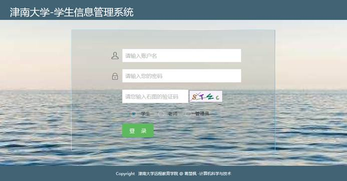
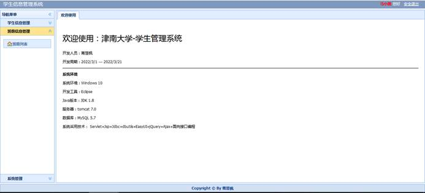

This is the **Capstone Project** for ***Bachelor of Engineering in Computer Science and Technology*** at ***Nankai University***, designed and implemented by [Chufeng Jiang](https://chufeng-jiang.github.io/) individually, and advised by [Dr. Haiwei Zhang](https://dbis.nankai.edu.cn/2023/0322/c12139a506916/page.htm).  

The project report can be found in this [repository](https://github.com/Chufeng-Jiang/SSM_Student-Information-Management-System) and the source code is not allowed to release by the school.

**Bio:** [Chufeng Jiang](https://chufeng-jiang.github.io/) enter this CS program at *Nankai University* with a *Bachelor of Management in Accounting* from *Hunan University*. She is concurrently pursuing *Master of Science in Computer Science (Bridge Program)*  at the *University of Birmingham  (Dubai)*.

 2022.06 &nbsp;&nbsp;&nbsp;&nbsp;
 

